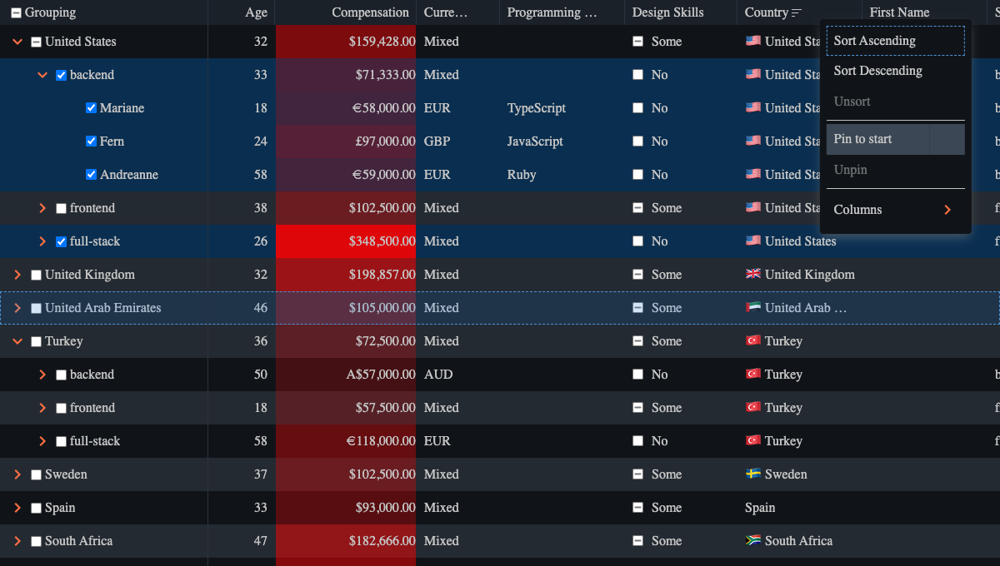

<div align="center">

<h1>
<b>Infinite Table</b>
</h1>
<h3>One Table — Infinite Applications</h3>
  <a href="https://infinite-table.com">
    
  </a>
<h4 style="margin-bottom: 20px;">Infinite Table is the modern DataGrid for building React apps — faster.</h4>
</div>




## Table Of Contents

<!-- START doctoc generated TOC please keep comment here to allow auto update -->
<!-- DON'T EDIT THIS SECTION, INSTEAD RE-RUN doctoc TO UPDATE -->

- [🤔 What is Infinite Table?](#-what-is-infinite-table)
- [📦 Installation](#-installation)
- [📄 Extensive documentation](#-extensive-documentation)
- [❤️ TypeScript](#-typescript)
- [🏢 Enterprise-ready](#-enterprise-ready)
  - [🔒 Secure by default](#-secure-by-default)
  - [📦 Small bundle size](#-small-bundle-size)
  - [🧪 Automated end-to-end tests](#-automated-end-to-end-tests)
- [🎨 Themable](#-themable)
- [🚀 Releases](#-releases)
- [📑 License](#-license)

<!-- END doctoc generated TOC please keep comment here to allow auto update -->


## 🤔 What is Infinite Table?

`Infinite Table` is a React DataGrid component for displaying virtualized tabular data. It helps you display huge datasets and get the most out of them by providing you the right tools to do so: 

* [🔃 sorting](https://infinite-table.com/docs/latest/learn/working-with-data/sorting)
* [💪 row grouping](https://infinite-table.com/docs/latest/learn/grouping-and-pivoting/grouping-rows) - both server-side and client-side
* [🏢 pivoting](https://infinite-table.com/docs/latest/learn/grouping-and-pivoting/pivoting/overview) - both server-side and client-side
* [🧪 aggregations](https://infinite-table.com/docs/latest/learn/grouping-and-pivoting/grouping-rows#aggregations)
* [🌪️ live pagination](https://infinite-table.com/docs/latest/learn/working-with-data/live-pagination)
* [🌴 lazy loading](https://infinite-table.com/docs/latest/learn/working-with-data/lazy-loading)
* [🧭 keyboard navigation for cells and rows](https://infinite-table.com/docs/latest/learn/keyboard-navigation/navigating-cells)
* [↔️ fixed and flexible columns](https://infinite-table.com/docs/latest/learn/columns/fixed-and-flexible-size)
* [🧩 column grouping](https://infinite-table.com/docs/latest/learn/column-groups)
* [🗃 filtering](https://infinite-table.com/docs/latest/learn/filtering)
* [🎨 theming](https://infinite-table.com/docs/latest/learn/theming)


## 📦 Installation

```bash
npm install @infinite-table/infinite-react --save
```

## [📄 Extensive documentation](https://infinite-table.com/docs)

Our approach with the `InfiniteTable` is to go documentation first. From our developer experience we know that most software products lack a good documentation. So we want to be different and start with the documentation first since our purpose is to have an outstanding documentation that developers can actually use.

**[Visit our docs and getting-started guide](https://infinite-table.com/docs)**

## ❤️ TypeScript

It's fully typed and offers you great developer experience to help you get up and running quickly

> The TypeScript typings file is included in the npm package - you don't have to download an additional **@types** package.

## 🏢 Enterprise-ready

Infinite Table is ready to power your enterprise apps, as it supports advanced data fetching, filtering, sorting, grouping, pivoting, aggregations, live pagination, lazy loading - all of those with support for both client-side and server-side implementations.

You can choose to leverage our built-in implementations in the browser or you can process your data on the server with full support from our-side.

### 🔒 Secure by default

We take security seriously and only have a total of 3 dependencies in our full dependency graph - and this number will only go down.

### 📦 Small bundle size

Our bundle size is under `250kB` and we're [keeping it small](https://bundlephobia.com/package/@infinite-table/infinite-react).

### 🧪 Automated end-to-end tests

Our releases are automated and we have [end-to-end tests](https://github.com/infinite-table/infinite-react/tree/master/source/examples/src/pages/tests) that ensure we're delivering to our standards. Real-browser tests help us move with confidence and continue to ship great features.


## 🎨 Themable

`Infinite Table` is fully customizable, via CSS variables. It ships with both a **light** and a **dark** theme - you have to import the CSS file from the package.

```js
import "@infinite-table/infinite-react/index.css"
```

This file includes both the light and the dark themes.

## 🚀 Releases

We release often - see [what each release contains hre](https://infinite-table.com/docs/releases). Due to our automated releases which have integrated tests, we're confident that we're delivering the best possible experience to our users.

## 📑 License 

Both Open and [Commercial License](https://github.com/infinite-table/react-table/blob/master/source/LICENSE.md)