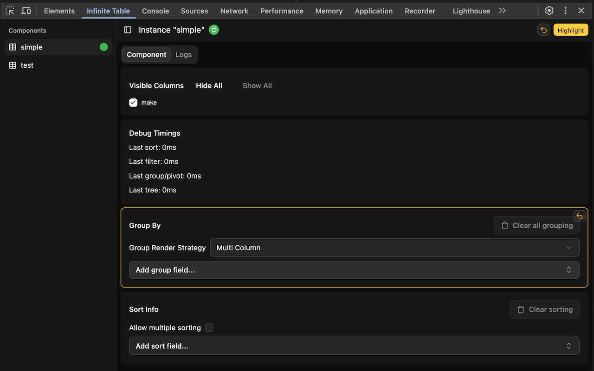

# Infinite Table Developer Tools

In order to interact with Infinite Table DevTools, you need to have Infinite Table version >=7 installed

Adds Infinite Table DataGrid debugging tools to the Chrome Developer Tools.

This extension allows you to interact with Infinite Table DataGrid instances (you need to have version >=7 installed) from your dev console.

You will get a new tab in your Chrome DevTools: "Infinite Table".

In this tab, you will see all your components that have the "debugId" prop set. Use this prop to decide which components you want to see in the devtools.

By selecting a component from the list in the sidebar, you will be able to interact with it, change it at runtime and see important debugging information:
 - you will see the logs, even if logging is not turned on via localStorage.debug='*'
 - you will be displayed important warnings about various misconfigurations
 - you will see debug timings - how much it took the DataSource to sort, group, filter and pivot the data
 - you will be able to interact with column visibility, grouping, sorting and more directly in your DevTools, and see info about the current state of the DataGrid.

This extension requires permissions to access the page's Infinite Table DataGrid component instances, but it does not send data remotely - everything happens locally in the browser.

For docs on Infinite Table, see https://infinite-table.com/

You can find the source-code of the extension at https://github.com/infinite-table/infinite-react/tree/master/devtools
